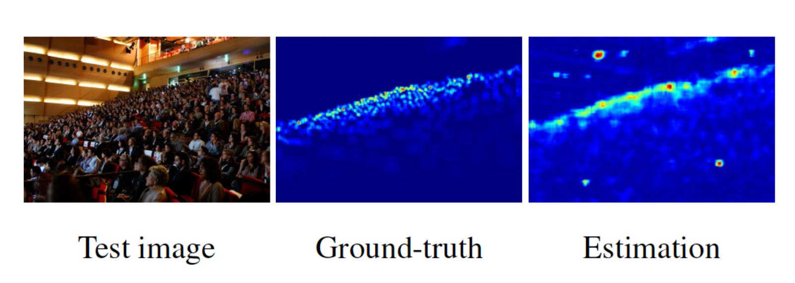

# Crowd Counting Package

`crowdcount` is a library for crowd counting with `Pytorch` and supported by `Fudan-VTS Research`

## Source
 - `code`: [https://github.com/FDU-VTS/crowd-count](https://github.com/FDU-VTS/crowd-count)
 - `document`: [https://crowd-count.readthedocs.io/en/latest/](https://crowd-count.readthedocs.io/en/latest/)

## Install
 - `pip install crowdcount --user --upgrade`
 
## Introduction

#### Crowd counting task:
 - estimate the number of crowd
 - 
 
#### User guide:
 - models
 
        from crowdcount.models import * 
        # crowd counting models includes csr_net, mcnn, resnet50, resnet101, unet, vgg
 - transforms
 
        import crowdcount.transforms as cc_transforms
        # transforms
 - data_loader
 
        from crowdcount.data.data_loader import *
        # includes ShanghaiTech, UCF_QNRF, UCF_CC_50, Fudan-ShanghaiTech temporarily
 - data_preprocess
 
        from crowdcount.data.data_preprocess import *
        # gaussian preprocess for datasets
        
 - utils
 
        from crowdcount.utils import *
        # includes loss functions, optimizers, tensorboard and save function
 
 - engine
 
        from crowdcount.engine import train
        # start to train
        train(*args, **kwargs)
    
 - More details in [document](https://crowd-count.readthedocs.io/en/latest/)

#### Demo
    from crowdcount.engine import train
    from crowdcount.models import Res101
    from crowdcount.data.data_loader import *
    from crowdcount.utils import *
    import crowdcount.transforms as cc_transforms
    import torchvision.transforms as transforms
    
    # init model
    model = Res101()
    # init transforms
    img_transform = transforms.Compose([transforms.ToTensor(),
                                        transforms.Normalize(mean=[0.452016860247, 0.447249650955, 0.431981861591],
                                                             std=[0.23242045939, 0.224925786257, 0.221840232611])
                                        ])
    gt_transform = cc_transforms.LabelEnlarge()
    both_transform = cc_transforms.ComplexCompose([cc_transforms.TransposeFlip()])
    # init dataset
    train_set = ShanghaiTechDataset(mode="train",
                                    part="b",
                                    img_transform=img_transform,
                                    gt_transform=gt_transform,
                                    both_transform=both_transform,
                                    root="/home/vts/chensongjian/CrowdCount/crowdcount/data/datasets/shtu_dataset_sigma_15")
    test_set = ShanghaiTechDataset(mode="test",
                                   part='b',
                                   img_transform=img_transform,
                                   root="/home/vts/chensongjian/CrowdCount/crowdcount/data/datasets/shtu_dataset_sigma_15")
    # init loss
    train_loss = AVGLoss()
    test_loss = EnlargeLoss(100)
    # init save function
    saver = Saver(path="../exp/2019-12-22-main_sigma15_6")
    # init tensorboard
    tb = TensorBoard(path="../runs/2019-12-22-main_sigma15_6")
    # start to train
    train(model, train_set, test_set, train_loss, test_loss, optim="Adam", saver=saver, cuda_num=[3], train_batch=2,
          test_batch=2, learning_rate=1e-5, epoch_num=500, enlarge_num=100, tensorboard=tb)

 - you can find more demos in [demo](https://github.com/FDU-VTS/crowd-count/blob/master/demo)
 
## Experiments
we will add the results soon

## Thanks for the supports from
- [C-3-Framework](https://github.com/gjy3035/C-3-Framework)
- [CSRNet](https://github.com/leeyeehoo/CSRNet-pytorch)
- [Awesome-Crowd-Counting](https://github.com/gjy3035/Awesome-Crowd-Counting)
